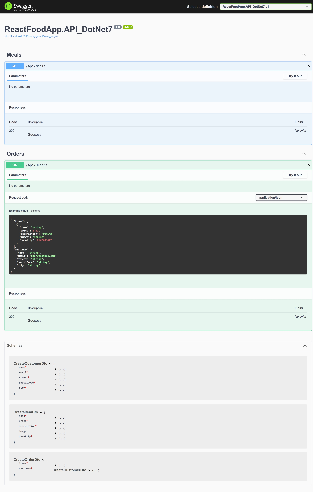

# ReactFoodApp.API_DotNet7

This project is an API developed with .NET 7, designed to provide meal information and place orders, showcasing the use of .NET technologies for building RESTful services.
## Demo


## Features

- RESTful API endpoints to retrieve walk details.
- Implementation of CRUD operations.
- Use of .NET 7 for backend development.

## Getting Started

### Prerequisites

- .NET 7 SDK
- Visual Studio 2022 or another compatible IDE that supports .NET 7

### Installation

1. Clone the repository:
```git clone https://github.com/PomiHD/ReactFoodApp.API_DotNet7.git ```
2. Open the solution in Visual Studio or your preferred IDE.

### Running the Application

- Use the `dotnet run` command within the project directory, or run the project directly from within Visual Studio.

## Usage

The API supports various operations related to Meals in the Food App, such as fetching Meal details. Explore the controllers for available endpoints.

